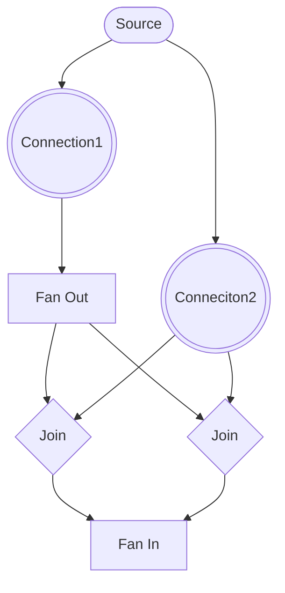

# Planner

SQLite plans single table queries. Our planner plans the joins.

Note: It may eventually plan single table queries as it becomes necessary on the frontend and/or we decide to replace SQLite with a different store.

## Architecture: Structure vs. Planning State

The planner uses a **dual-state design pattern** to separate concerns and enable fast planning:

### Graph Structure (Immutable)

Built once by `planner-builder.ts` and never modified during planning:

- **Nodes**: Sources, Connections, Joins, FanOut/FanIn, Terminus
- **Edges**: How nodes connect to each other (parent/child relationships)
- **Configuration**: Cost models, filters, orderings, constraints definitions

Think of this as the "blueprint" of the query - the structural relationships that don't change.

### Planning State (Mutable)

Modified during `PlannerGraph.plan()` as we search for the optimal execution plan:

- **Pinned flags**: Which connections have been locked into the plan
- **Join types**: Whether joins are 'semi' (original) or 'flipped' (reversed)
- **Accumulated constraints**: What constraints have propagated from parent joins

Think of this as the "current attempt" - the state that changes as we explore different plans.

### Why This Separation?

1. **Performance**: Mutating state in-place is much faster than copying entire graph structures
2. **Multi-start search**: Can `resetPlanningState()` and try different starting connections
3. **Backtracking**: Can `capturePlanningSnapshot()` and `restorePlanningSnapshot()` when attempts fail
4. **Clarity**: Makes it obvious what changes during planning vs. what's fixed structure

This pattern is common in query optimizers (see Postgres, Apache Calcite, etc.) where the search space is large and performance matters.

## Graph

The planner creates a graph that represents the pipeline. This graph consists of nodes that are relevant to planning joins:

1. **Connection** - Represents a table scan with filters and ordering
2. **Join** - Combines two data streams (parent and child)
3. **FanOut** - Distributes a single stream to multiple branches (used in OR conditions)
4. **FanIn** - Merges multiple branches back into a single stream
5. **Terminus** - The final output node where constraint propagation begins

Note: `PlannerSource` exists as a factory for creating connections but is not itself a graph node.

**Example graph:**

```ts
issue
  .where(
    ({or, exists}) => or(
      exists('parent_issue', q => q.where('id', ?)),
      exists('parent_issue', q => q.where('id', ?)),
    )
  )
```



### FanOut/FanIn Type Conversion

FanOut and FanIn nodes have two variants that affect how branches are handled:

**FanIn Types:**

- **FI (Normal FanIn)**: All branches share the same branch pattern `[0, ...]`. Used when branches are correlated (no flipped joins between FO and FI).
- **UFI (Union FanIn)**: Each branch gets a unique pattern `[0, ...]`, `[1, ...]`, etc. Required when joins are flipped, making branches independent.

**FanOut Types:**

- **FO (Normal FanOut)**: Standard distribution to branches.
- **UFO (Uncorrelated FanOut)**: Marks that downstream branches are independent.

**Conversion Trigger:**

When a join is flipped between a FanOut and its corresponding FanIn, both must convert:

- FO → UFO
- FI → UFI

This happens automatically during the planning phase via `checkAndConvertFOFI()` after join flipping.

**Why This Matters:**

UFI changes cost semantics. Consider `(A OR B) AND (C OR D)`:

- With FI: Evaluates as a single correlated operation
- With UFI: Each branch is independent, causing exponential cost growth if chained

The conversion ensures accurate cost modeling when joins are reordered.

## Plan Shape

```ts
// planner-builder.ts
export type Plans = {
  plan: PlannerGraph;
  subPlans: {[key: string]: Plans};
};
```

Because a query can be composed of sub-queries, a query plan can be composed of sub-plans. Concretely, `related` calls get their own query plans.

```ts
issue
  .related('owner', q => ...)
  .related('comments', q => ...);
```

The above query would result in a plan that is composed of 3 plans:

- Plan for the top level issue query
- Plan for the nested owner query
- Plan for the nested comments query

If there is more nesting, or more sibling related calls, there are more plans. There is a tree of plans.

`exists` calls do not create separate plans. All `exists` are planned together (that's the whole point of the planner!) as `exists` are inner & semi-joins so they are what need planning.

```ts
issue
  .exists('owner', q => ...)
  .exists('comments', q => ...)
```

The above query would result in a single plan that is not composed of any other plans. This is also the case if more exists were present.

## Planning Algorithm

The planner uses **exhaustive join flip enumeration** to find the optimal query execution plan.

### Approach

Given a query with `n` flippable joins (EXISTS checks), the planner:

1. **Enumerates all flip patterns**: Tries all 2^n possible combinations of flipping/not-flipping each join
2. **Evaluates each pattern**: For each combination, calculates the total query cost
3. **Selects the best**: Chooses the plan with the lowest cost

### Algorithm Steps

For each flip pattern (0 to 2^n - 1):

1. **Reset planning state** - Clear all mutable state from previous attempt
2. **Apply flip pattern** - Treat pattern as bitmask; bit `i` = 1 means flip join `i`
3. **Derive FO/FI states** - Convert FO→UFO and FI→UFI if any join between them is flipped
4. **Propagate unlimiting** - Remove EXISTS limits from connections in flipped join child subgraphs
5. **Propagate constraints** - Send constraints up the graph from the terminus
6. **Evaluate cost** - Calculate total cost for this plan
7. **Track best** - If this is the lowest cost so far, save the plan state

Finally, restore the best plan found.

### Safety Limits

To prevent excessive planning time, the planner enforces `MAX_FLIPPABLE_JOINS = 13`:

- 10 joins → 1,024 plans (~100-200ms)
- 12 joins → 4,096 plans (~400ms-1s)
- 13 joins → 8,192 plans (~1-2s)

Queries exceeding this limit will throw an error suggesting simplification.

### Why Exhaustive?

Unlike greedy approaches that make local decisions, exhaustive enumeration:

- **Guarantees optimal plan**: Explores the entire search space
- **Handles complex interactions**: Correctly evaluates how join flips affect downstream costs
- **Practical for most queries**: Most queries have ≤5 EXISTS checks, making 2^5 = 32 evaluations trivial

The trade-off is exponential growth, hence the safety limit.

## Cost Estimation

The cost of a connection is the estimated number of rows that will be scanned by that connections as well as any additional post-processing run against the connection to return those rows.

Examples:

```sql
SELECT * FROM issue;
```

The cost of the above would be the size of the issue table.

```sql
SELECT * FROM issue WHERE creator_id = ?;
```

The cost of the above would be the average number of rows per creator.

```sql
SELECT * FROM issue ORDER BY unindexed_column;
```

The cost of the above would be the size of the issue table + the cost to create a temp b-tree that contains all rows. This is one of those post processing steps referred to earlier.

`planner-connection.ts` takes a function that can return a cost, allowing different cost models to be applied. E.g., SQLite's or our own.

Limits are never provided to the cost estimator as we can never know how many rows will be filtered out before fulfilling a limit.

### Cost Estimation with Branch Patterns

The `estimateCost()` method accepts an optional branch pattern parameter:

- **`estimateCost(undefined)`**: Returns the sum of costs across all branches. Used by `getUnpinnedConnectionCosts()` to rank connections for selection.
- **`estimateCost([0, 1, 2])`**: Returns the cost for a specific branch pattern. Used during constraint propagation when joins estimate their costs.

Branch patterns flow through the graph during both constraint propagation and cost estimation:

- **FanIn (FI)**: Passes `[0, ...]` to all branches (correlated)
- **Union FanIn (UFI)**: Passes `[i, ...]` with unique index per branch (independent)
- **Joins**: Pass through the branch pattern unchanged

**Caching Strategy:**

To avoid redundant cost model invocations, connections cache costs at two levels:

1. **Total cost cache**: The sum of all branch costs (when `branchPattern === undefined`)
2. **Per-constraint cache**: A map from branch pattern key (`"0,1"`) to computed cost

Both caches are invalidated when constraints change during propagation.

## Join Flipping Mechanics

Each join can be in one of two states:

- **Semi-join**: Parent is outer loop, child is inner loop (original query order)
- **Flipped join**: Child is outer loop, parent is inner loop (reversed)

The exhaustive planner treats each flip pattern as a binary string where bit `i` determines whether join `i` is flipped.

**Example with 3 flippable joins:**

- Pattern `000` (0): All semi-joins (original query order)
- Pattern `001` (1): Only join 0 flipped
- Pattern `101` (5): Joins 0 and 2 flipped
- Pattern `111` (7): All joins flipped

**NOT EXISTS joins** are marked as unflippable and never participate in enumeration.

## Constraint Propagation

After applying a flip pattern, constraints are propagated up the graph from the terminus node to update connection cost estimates.

**Constraint Flow:**

`terminus -> ... -> join -> ... -> join -> connection`

**Join Constraint Rules:**

- **Semi-join** (not flipped):
  - Sends its `childConstraint` to the child connection
  - Forwards received constraints to the parent connection
- **Flipped join**:
  - Sends `undefined` to the child connection (child is now outer loop, unconstrained)
  - Merges its `parentConstraint` with received constraints and sends to parent

**Why This Matters:**

Constraints represent which columns are available for index lookups. When a join is flipped, the outer/inner loop relationship changes, altering what constraints are available:

- **Semi-join**: Parent rows drive child lookups → child gets constraining columns
- **Flipped join**: Child rows drive parent lookups → parent gets constraining columns

See `planner-join.ts` for implementation details.

### Branch Patterns

Branch patterns are arrays of numbers that uniquely identify paths through the query graph, particularly when OR conditions create multiple branches.

**How They Work:**

1. **Terminus starts with `[]`**: The empty pattern at the root
2. **FanIn adds a prefix**:
   - **FI**: Adds `[0, ...]` to all branches (correlated access)
   - **UFI**: Adds `[i, ...]` with unique `i` per branch (independent access)
3. **Other nodes pass through unchanged**: Joins, FanOuts, Connections preserve the pattern

**Example: OR Query**

```ts
track.where(({or, exists}) => or(exists('album'), exists('invoiceLines')));
```

If the FanIn is converted to UFI (because a join flipped), constraint propagation generates two patterns:

- Branch 0 (album path): `[0]`
- Branch 1 (invoiceLines path): `[1]`

**Why Branch Patterns Matter:**

1. **Constraint Tracking**: Connections map constraints by branch pattern key (`"0"`, `"1"`, `"0,1"`)
2. **Cost Estimation**: Each branch can have different costs based on its constraints
3. **Exponential Cost Growth**: Chained UFIs create cartesian products:
   - `(A OR B)` → 2 branches
   - `(A OR B) AND (C OR D)` → 4 branches (2×2)
   - Three ORs → 8 branches (2×2×2)

This is why the planner tries to avoid flipping joins in OR regions when possible.

---

## NOT EXISTS Handling

`NOT EXISTS` joins cannot be flipped. They are marked as `flippable: false` and are excluded from the enumeration process. Only flippable joins (standard EXISTS checks) participate in the flip pattern enumeration.

If a flip pattern would require flipping an unflippable join (which shouldn't happen with proper `isFlippable()` checks), it would throw an `UnflippableJoinError` and that pattern would be skipped.
